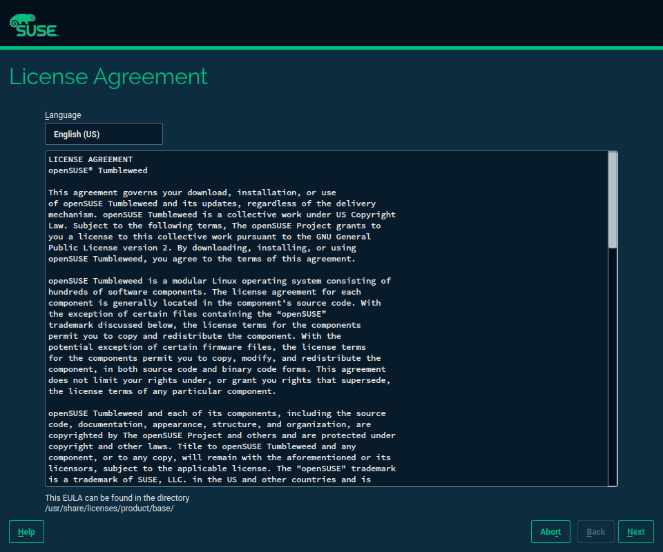
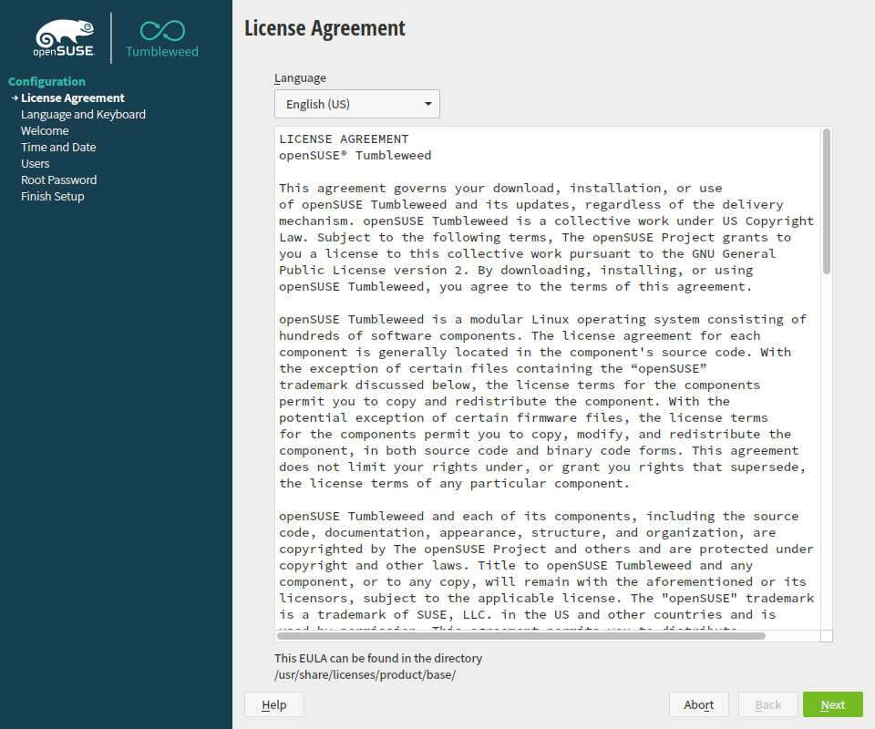
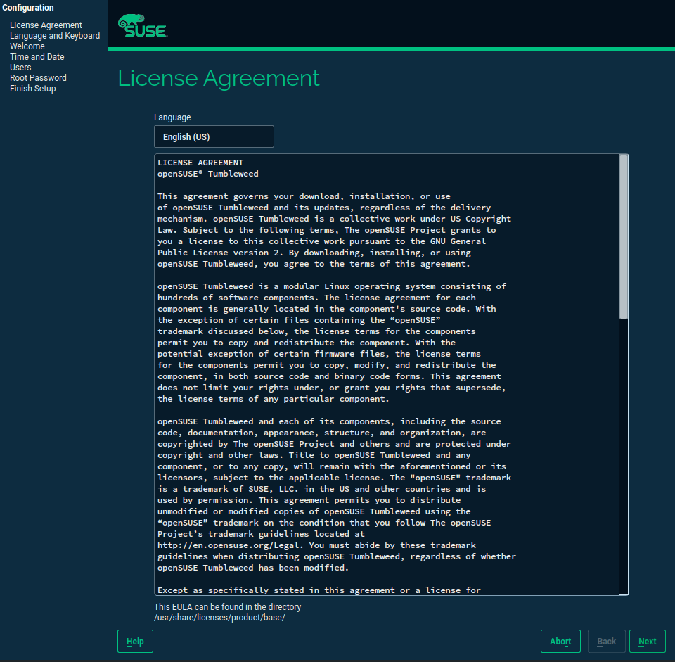

Product Installation Control
============================

Functionality
-------------

The product control file is used to customize the installation process.
It allows to enable and disable features and it defines the workflow,
that is, what is really shown to the user during the installation.

Besides workflow configuration, other system variables are configurable
and can be predefined by the system administrator. To name a few: the
software selection, environment settings such as language, time zone and
keyboard can be configured and would override default variables provided
with shipped products.

The idea of having a pre-defined installation workflow and pre-defined
system settings provides a middle ground between manual installation and
automated installation.

The product configuration file is provided as a text file on the
installation media and defines various settings needed during
installation. The following is a list of supported configuration
options:

-   Workflow

    Replaces the static workflow list with a configurable list using the
    product configuration file. Entire sections of the workflow can be
    skipped.

    For example, it is possible to set the language variable in the
    configuration file if the installation language is to be forced for
    some reason, e.g. if an IT department wants to force French
    installations, say in Quebec, Canada, then the entire dialog can
    be skipped. If the IT department is to recommend some settings but
    still give the user the choice to change the default settings, the
    language dialog will be shown with French preselected.

    If none of the above options is used, the default dialog settings
    are shown.

-   Proposals

    As with the workflow, proposals are also configurable. For example,
    certain products would skip some proposals. In the proposal screen
    the pre-configured settings can be shown with the possibility to
    change them or with inactive links if the configuration is to be
    forced.

-   System Variables

    This lets the user define system variables like language, keyboard, time
    zone, window manager, display manager etc. The defined variables
    will be used as defaults in the respective dialogs.

-   Package Selections and additional individual packages

    This defines what base package selection and add-on selections should be
    used for the installation. Additionally this provides the possibility to
    define a list of additional packages. All packages and selections
    can be selected depending on the architecture using a special
    architecture attribute in the configuration file.

-   Partitioning

    This is to customize disk usage, including minimum and maximum useful size
    of the root filesystem, what filesystem type to use, whether or not to use
    LVM and encryption, and what subvolumes to create if Btrfs is used on the
    root filesystem.

-   Scripting and Hooks

    To customize installation further more, hooks and special slots can
    be defined where the user can execute scripts. For example, scripts
    can be executed at the very beginning of the installation (After
    processing the configuration file), in the installation system
    before initial boot, in the chroot-ed environment and after initial
    boot and before/after every step in the workflow. Scripting
    languages supported during installation are currently Shell, Perl.

Implementation
--------------

The control file is implemented in simple structured XML syntax which so
far has been used for automated installation. The XML structure used
can be mapped easily to YaST data structures and all data types
available in YaST are supported for easy data access and manipulation.

The primary use of the control file is to configure the workflow of the
installation, and it offers the possibility to predefine a certain setup,
but it also defines product installation features and other product
related variables.

> **Note**
>
> Note that the control file is not an optional tool to help customize
> installation, it is required during installation, and without the file,
> installation may fail or lead to unexpected results. The control file on the installed
> system located in `/etc/YaST2/control.xml` is owned by the `${PRODUCT}-release`
> package.

During installation, *linuxrc* searches for a file named
`control.xml` on the installation medium (CD, NFS, FTP..) and copies the
file into the installation system and makes the file available to YaST.
YaST then starts and looks for the control file in 3 locations before it
starts with the installation workflow:

0.  custom control file - runtime specified control file. Used only in special
    cases like wagon upgrade work-flow.

1.  `/y2update/control.xml`

    File in special directory to update installer on-fly. Needed only for
    work-arounds and customer specific solutions.

2.  `/control.xml`

    Usually the file is in the top directory after it has been copied by
    linuxrc and during the initial installation phase.

3.  `/etc/YaST2/control.xml`

    This is the location where the release package installs the file of
    the installed product.

One of the main reasons for using the control is to provide non-YaST
developers the ability to change the installation behavior and customize
various settings without the need to change and re-build YaST packages.

This way it is possible to define different behavior and different installation
defaults in SLE and openSUSE products.

The control files for SUSE products are maintained at specific Git
repositories (e.g. for [SLES](https://github.com/yast/skelcd-control-SLES/blob/master/control/control.SLES.xml),
[SLED](https://github.com/yast/skelcd-control-SLED/blob/master/control/control.SLED.xml)
or [openSUSE](https://github.com/yast/skelcd-control-openSUSE/blob/master/control/control.openSUSE.xml)
).


Configuration
-------------

### Workflows

Using the control file, multiple workflows can be defined for different
modes and installation stages. Thus, the element *workflows* in the
control file evaluates to a list of workflows.

Beside defining what YaST clients should be executed during
installation, the workflow configuration also lets you specify the wizard
steps and how they should appear during graphical installation.

A workflow list element is a map with the following elements:

-   *label*

    The label of the workflow as it appears on the left side of the
    wizard. For example *Base Installation*.

-   *defaults*

    The default arguments to the clients. This is a map element.

-   *stage*

    This options defines the stage or phase of the installation. Possible
    values are *initial* for the initial stage and *continue* for the
    workflow of the installation after reboot.

-   *mode*

    Defines the installation mode. Several modes are available; the most
    important modes are:

    -   installation

    -   update

    -   autoinst

-   *modules*

    This is the actual workflow and is a list of elements describing the
    order in which the installation should proceed.

    A module element is a map with the following configuration options:

    -   name: The name of the module. All installation clients and
        modules have a unified prefix (inst\_) which can be omitted
        here. The name is often used as an ID, so it should be unique within the whole
        control file. That is why there is the _execute_ parameter (see below). For
        example, if the YaST file for the module is called *inst\_test*, then
        the name in the control file is *test*.

    -   label: The label of the module in the step dialog. This is an
        optional element. If it is not set, the label of the previous
        module is used.

    -   arguments: The arguments for the module. This is a comma-separated
        list which can accept booleans and symbols.

    -   execute: If it is needed to call a script with a name that does not start with
        *inst_* or you need to call the same script several times with a
        different *name* parameter.

The following listing shows a typical installation workflow:

```xml
    <workflows config:type="list">
        <workflow>
            <!-- 'label' is what the user will see -->
            <label>Base Installation</label>
            <!-- default settings for all modules -->
            <defaults>
                <!-- arguments for the clients -->
                <arguments>false,false</arguments>
                <!-- allowed architectures "all", "i386", "i386,ia64,x86_64", see
                  Arch module in yast-yast2 for all possible options  -->
                <archs>all</archs>
            </defaults>
            <stage>initial</stage>
            <mode>installation,update</mode>
            <modules  config:type="list">
                <module>
                    <name>info</name>
                    <arguments>false,true</arguments>
                </module>
                <module>
                    <name>proposal</name>
                    <arguments>true,true,`ini</arguments>
                    <label>Installation Settings</label>
                </module>
                <module>
                    <name>do_resize</name>
                    <update config:type="boolean">false</update>
                    <archs>i386,x86_64,ia64</archs>
                    <label>Perform Installation</label>
                </module>
                <module>
                    <name>prepdisk</name>
                    <!-- Multiple modules with the same 'label' will be
                         collapsed to one single user-visible step.
                         The step is considered finished when the last module
                         with the same 'label' is finished.  -->
                    <label>Perform Installation</label>
                </module>
                <module>
                    <name>kickoff</name>
                    <label>Perform Installation</label>
                </module>
                <module>
                    <name>rpmcopy</name>
                    <label>Perform Installation</label>
                </module>
                <module>
                    <name>finish</name>
                    <label>Perform Installation</label>
                </module>
            </modules>
        </workflow>
    </workflows>
```

### Proposals

Part of the installation workflows are proposal screens, which consist
of a group of related configuration settings. For example *Network*,
*Hardware* and the initial *Installation* proposal.

If you want for some reason to add or modify a proposal, which is
discouraged because of configuration dependencies, then this would be
possible using the control file.


```xml
<proposal>
    <label>Installation Settings</label>
    <mode>installation</mode>
    <stage>initial</stage>
    <name>initial</name>
    <unique_id>inst_initial</unique_id>
    <enable_skip>no</enable_skip>
    <proposal_modules config:type="list">
        <proposal_module>
            <name>bootloader</name>
            <presentation_order>20</presentation_order>
        </proposal_module>
        <proposal_module>
            <name>hwinfo</name>
            <presentation_order>80</presentation_order>
        </proposal_module>
        ...
    </proposal_modules>
</proposal>
```

Each proposal definition can contain these values:

```xml
<proposal_module>
    <name>module_name</name>
    <presentation_order>50</presentation_order>
    <read_only config:type="boolean">true</read_only>
</proposal_module>
```

Details:

- `name` (string) - proposal client name without the `_proposal` suffix
  (the code actually allows writing it but that makes the definitions longer
  and less readable).
- `presentation_order` (integer, optional) - the number defines the display order
  in the proposal. The absolute value is not important; it depends on the relative
  value when compared against the other proposal modules.
- `read_only` (boolean, optional) - the module is treated as read only, and
  any user interaction with the proposal module is disabled.

In the workflow, the proposals are called as any workflow step with an
additional argument identifying the proposal screen to be started.
(*\`net* for network, *\`hw* for hardware and *\`service* for service
proposals. The following examples shows how the network proposal is
called as a workflow step:

```xml
    <module>
        <label>Network</label>
        <name>proposal</name>
        <arguments>true,true,`net</arguments>
    </module>
```

### Installation and Product Variables

It is possible to define some installation variables (language,
timezone, keyboard,.. ) and force them in the proposal. The user will still
be able to change them, however.

The following variables can be set:

-   Timezone

-   Language

-   Keyboard

-   Auto Login (not recommended for multi-user environments and server
    installations)

-   IO Scheduler

    The default is *as*.

-   Desktop Scheduler

The following example shows all options above:

```xml
    <globals>
        <enable_autologin config:type="boolean">true</enable_autologin>
        <language>de_DE</language>
        <timezone>Canada/Eastern</timezone>
        <use_desktop_scheduler config:type="boolean">true</use_desktop_scheduler>
        <io_scheduler>as</io_scheduler>
    </globals>
```

### Special Installation and Product Variables

These options usually enable or disable some installation feature.

-   (boolean) *enable\_firewall* - the firewall will proposed as either
    enabled or disabled in the network proposal.

-   (boolean) *enable\_clone* - the cloning feature will be either enabled
    or disabled.

-   (boolean) *skip\_language\_dialog* - the language dialog might be
    skipped (if language already selected).

-   (boolean) *show\_online\_repositories* - either shows or hides the
    "online repositories" feature check-box.

-   (boolean) *root\_password\_as\_first\_user* - automatically selects
    or deselects the checkbox that makes the users configuration set the
    password entered for a first user also for the user root. The default is
    *false*.

-   (boolean) *enable\_local\_users* - enable creating local user accounts
    during installation. If *false*, the corresponding dialog is skipped, and
    *root\_password\_as\_first\_user* is set to *false* as well.
    The default is *true*.

-   (boolean) *enable\_autoconfiguration* - enables a check box in the
    dialog that offers to switch the automatic configuration either on
    or off. The default is *false*.

-   (boolean) *autoconfiguration\_default* - defines a default value
    whether to use the automatic configuration. It works even if
    *enable\_autoconfiguration* is turned off, but the user would not be
    able to change it. The default is *false*.

-   (string) *base\_product\_license\_directory* - directory where the
    base-product licenses are stored (license.txt, license.de\_DE.txt,
    ...).

-   (boolean) *rle\_offer\_runlevel\_4* - defines whether runlevel 4
    should be offered in the Runlevel Editor. The default is *false*.

-   (boolean) *enable\_kdump* - defines whether kdump is proposed as
    *enabled* in the installation proposal. The *kdump\_proposal* client call
    has to be added to [proposal](#control_proposals); otherwise this
    variable does not have any effect.

-   (boolean) *write\_hostname\_to\_hosts* - defines whether the
    currently assigned hostname is written to /etc/hosts with IPv4
    address 127.0.0.2. The default is *false*.

-   (boolean) *dhclient\_set\_hostname* - defines the default of
    DHCLIENT_SET_HOSTNAME in /etc/sysconfing/network/dhcp which is
    preloading at the beginning of the installation. It can be disabled
    by [linuxrc](https://github.com/openSUSE/linuxrc/blob/master/linuxrc_yast_interface.txt#L144) cmdline with sethostname=0.

-   (boolean) *default\_ntp\_setup* - the NTP configuration proposes a
    default ntp server if set to *true*. The default is *false*.

-   (string) *polkit\_default\_privs* - Sets
    */etc/sysconfig/security/POLKIT\_DEFAULT\_PRIVS* to the defined
    value. If not set or empty, sysconfig is untouched.

-   (boolean) *require\_registration* - Require registration of add-on
    product (ignored in the base product).

-   (boolean) *readonly\_timezone* - The timezone cannot be changed by the
    user during installation or upgrade. The default value is
    determined using the *timezone* element in the *globals* section.
    If not specified, *UTC* will be used.

-   (boolean) *readonly\_language* - The user only could change the language of
    the installer, but not for the installed system which will use *en_US* by
    default.

### Installation Helpers

In the *globals* section, there are also helper variables for the
installation and debugging:

-   *save\_instsys\_content* - this is a list of entries that should be
    copied from the installation system to the just installed system
    before the first stage is finished and the system reboots to the second
    stage.

    This example shows how the content of the */root/* directory is copied
    to the */root/inst-sys/* directory on the installed system:

```xml
    <globals>
        <save_instsys_content config:type="list">
            <save_instsys_item>
                <instsys_directory>/root/</instsys_directory>
                <system_directory>/root/inst-sys/</system_directory>
            </save_instsys_item>
        </save_instsys_content>
    </globals>
```

-   (boolean) *debug\_workflow* - defines whether steps with the very
    same name in the workflow should not be collapsed. If *true*, those steps are
    not collapsed and a step ID is added after the step name. The
    default is *false*. This feature should be off in the production
    phase.

-   (boolean) *debug\_deploying* - defines whether deploying should
    write more debug logs and some more debugging features in the
    workflow. The default is *false*. This feature should be off in the
    production phase.

### Look & Feel

The *globals* section also offers some settings to configure the layout of the
installer. There are three possible layouts:

* With a left sidebar including the list of installation steps.
* Without a sidebar and placing the title of the dialogs on the left side.
* Without a sidebar and placing the title of the dialogs on top.

These settings can be used for configuring the layout:

-   (string) *installation_ui* - only accepts *sidebar* value. When used, the
    layout is configured to include a left sidebar with the installation steps.
    This setting is deprecated in favor of *installation_layout*.

-   *installation_layout*: this section includes a set of individual settings
    to configure the layout.

In the *installation_layout* section, these settings are available:

-   (string) *mode* - configures the layout mode and accepts these values:
    *steps*, *title-on-left* and *title-on-top*.
-   (boolean) *banner* - indicates whether a top banner should be included.
    The banner is typically used for placing a logo.

Note that *installation_layout* takes precedence over *installation_ui*. When
nothing is configured, the default layout is rendered with title on the left and
with the top banner (SLE flavor).

#### Examples

Some examples of different configurations and its visual result are shown below:

##### Example 1

```xml
<globals>
    <!-- installation_ui is ignored because installation_layout is used -->
    <installation_ui>sidebar</installation_ui>
    <installation_layout>
        <mode>title-on-top</mode>
        <banner config:type="boolean">true</banner>
    </installation_layout>
</globals>
```



##### Example 2

```xml
<globals>
    <!-- installation_ui is used because nothing is defined by installation_layout -->
    <installation_ui>sidebar</installation_ui>
    <installation_layout></installation_layout>
</globals>
```



##### Example 3

```xml
<globals>
    <installation_layout>
        <mode>steps</mode>
        <banner config:type="boolean">true</banner>
    </installation_layout>
</globals>
```



##### Example 4

```xml
<globals>
    <installation_layout>
        <mode>title-on-top</mode>
        <banner config:type="boolean">true</banner>
    </installation_layout>
</globals>
```


##### Example 5

```xml
<globals>
    <installation_layout>
        <mode>title-on-left</mode>
        <banner config:type="boolean">false</banner>
    </installation_layout>
</globals>
```


### Software

The *software* section defines the selection of software during installation or
update.

This is a list of supported entries in *software*:

-   *default\_desktop* - defines a desktop selected by default during
    installation.

-   *clone\_install\_recommended\_default* - Default entry for
    "install_recommended" in the created AutoYaST configuration file.

-   *minimalistic_libzypp_config* - adjust the libzypp configuration
    to reduce the amount of packages to install: only required
    packages are considered, no documentation and no multiversion.

Additionally, you can configure how updating of packages should be
performed. The following options are available:

-   *delete\_old\_packages*

    Do not delete old RPMs when updating.

-   *delete\_old\_packages\_reverse\_list*

    Inverts the *delete\_old\_packages* rule for products defined as
    list of regular expressions matching installed product name
    (SuSE-release).

```xml
    <!-- Delete old packages of all products but OES, SLES 9, SLE 10 and SLD 10 -->
    <software>
    <delete_old_packages config:type="boolean">true</delete_old_packages>
    <delete_old_packages_reverse_list config:type="list">
        <regexp_item>^UnitedLinux .*$</regexp_item>
        <regexp_item>^Novell Open Enterprise Server Linux.*</regexp_item>
        <regexp_item>^SUSE (LINUX|Linux) Enterprise Server 9$</regexp_item>
        <regexp_item>^SUSE (LINUX|Linux) Enterprise Server 9 .*$</regexp_item>
        <regexp_item>^SUSE (LINUX|Linux) Enterprise Server 10.*$</regexp_item>
        <regexp_item>^SUSE (LINUX|Linux) Enterprise Desktop 10.*$</regexp_item>
        <!-- Don't forget to define product itself (Service Pack) -->
        <regexp_item>^SUSE (LINUX|Linux) Enterprise Server 10 SP.*$</regexp_item>
        <regexp_item>^SUSE (LINUX|Linux) Enterprise Desktop 10 SP.*$</regexp_item>
    </delete_old_packages_reverse_list>
    </software>
```


-   *silently\_downgrade\_packages*

    Allows the packager to downgrade installed packages during the upgrade
    workflow.

-   *silently\_downgrade\_packages\_reverse\_list*

    Inverts the *silently\_downgrade\_packages* rule for products
    defined as list of regular expressions matching the installed product
    name (SuSE-release).

```xml
    <!-- For SLES10, packages are not downgraded -->
    <software>
    <silently_downgrade_packages config:type="boolean">true</silently_downgrade_packages>
    <silently_downgrade_packages_reverse_list config:type="list">
        <regexp_item>^SUSE (LINUX|Linux) Enterprise Server 10.*$</regexp_item>
    </silently_downgrade_packages_reverse_list>
    </software>
```

-   *products\_supported\_for\_upgrade*

    List of known products supported for upgrade (SuSE-release). Old
    releases or other distributions will report a warning.
    All products (regular expressions) are matching the string which can be
    found in */etc/\*-release* file.
    
    Regular expressions in \<regexp\_item\>s can contain standard regular
    expressions, such as
    
    -   The circumflex *\^* and the dollar sign *\$* as boundary characters
        for strings
    
    -   asterisk *\**, plus *+* and question mark *?* for repeating or
        existence.
    
    -   dot *.* as a wild-card character
    
    -   square brackets *[]* for a list of possible characters
    
    -   circle brackets *()* for listing possibilities
    
    -   special all-locale class-expressions *[:alnum:]*, *[:alpha:]*,
        *[:blank:]*, *[:cntrl:]*, *[:digit:]*, *[:graph:]*, *[:lower:]*,
        *[:print:]*, *[:punct:]*, *[:space:]*, *[:upper:]*, *[:xdigit:]*
    
    These regular expressions are evaluated as [POSIX regex]
    (www.regular-expressions.info/posix.html).
```xml
    <software>
        <products_supported_for_upgrade config:type="list">
            <regexp_item>^Novell LINUX Desktop 9.*</regexp_item>
            <regexp_item>^SUSE LINUX Enterprise Server 10.*</regexp_item>
            <regexp_item>^SUSE LINUX Enterprise Desktop 10.*</regexp_item>
            <regexp_item>^openSUSE .*</regexp_item>
        </products_supported_for_upgrade>
    </software>
```

-   *online\_repos\_preselected*

    Online Repositories are pre-selected by default to be used. This
    item can change the default behavior.

-   *upgrade\/product\_upgrades*

    List of product upgrades where defined vendors changes are possible
    without asking the user for confirmation.
```xml
    <software>
        <upgrade>
            <!-- Do not ask for vendor change during this defined upgrades -->
            <product_upgrades config:type="list">
                <product_upgrade>
                    <from>openSUSE Leap</from>
                    <to>openSUSE Jump</to>
                    <compatible_vendors config:type="list">
                      <compatible_vendor>openSUSE</compatible_vendor>
                      <compatible_vendor>SUSE LLC</compatible_vendor>
                    </compatible_vendors>
                </product_upgrade>
	    </product_upgrades>
        </upgrade>
    </software>
```

### Supported Desktops

This part defines not only all the desktops for Desktop Selection dialog
during installation, but also the
[default\_desktop](#software_default_desktop) must be defined.

Example of supported desktops:

```xml
    <productDefines  xmlns="http://www.suse.com/1.0/yast2ns"
        xmlns:config="http://www.suse.com/1.0/configns">
        <software>

            <supported_desktops config:type="list">

                <one_supported_desktop>
                    <name>gnome</name>
                    <desktop>gnome</desktop>
                    <label_id>desktop_gnome</label_id>
                    <logon>gdm</logon>
                    <cursor>DMZ</cursor>
                    <packages>gdm</packages>
                    <order config:type="integer">1</order>
                    <patterns>gnome x11 base</patterns>
                    <icon>pattern-gnome</icon>
                    <description_id>description_gnome</description_id>
                </one_supported_desktop>

                <one_supported_desktop>
                    <name>kde</name>
                    <desktop>kde4</desktop>
                    <!-- Generic ID used in texts below -->
                    <label_id>desktop_kde</label_id>
                    <logon>kdm4</logon>
                    <cursor>DMZ</cursor>
                    <packages>kde4-kdm</packages>
                    <order config:type="integer">1</order>
                    <patterns>kde x11 base</patterns>
                    <icon>pattern-kde4</icon>
                    <!-- Generic ID used in texts below -->
                    <description_id>description_kde</description_id>
                </one_supported_desktop>

            </supported_desktops>

        </software>

        <texts>

            <desktop_gnome><label>GNOME</label></desktop_gnome>
            <!-- See 'desktop_kde' in 'supported_desktops' -->
            <desktop_kde><label>KDE 4.1</label></desktop_kde>

            <description_gnome><label>Some description</label></description_gnome>
            <!-- See 'description_kde' in 'supported_desktops' -->
            <description_kde><label>Some description</label></description_kde>

        </texts>
    </productDefines>
```

The *supported\_desktops* section contains a list of one or more
*one\_supported\_desktop* sections.

-   (string) *name*

    Unique ID.

-   (string) *desktop*

    Desktop to start (gnome, kde4, kde, xfce, ...).

-   (string) *label\_id*

    Text ID used for desktop selection label.

-   (string) *logon*

    Login manager to start (gdm, kdm4, kdm3, xdm, ...).

-   (string) *cursor*

    Cursor theme.

-   (string) *packages*

    List of packages (whitespace-separated) that identify and verify which
    desktop was selected by the user (or automatically). These packages are
    *not* selected for installation by Yast; use *patterns* for that.

-   (integer) *order*

    Numeric order of the desktop in the Desktop Selection dialog. Number *1*
    is reserved for major desktops that are displayed with description
    (*description\_id* is required). If the very same *order* is used
    for more than one desktops, they are sorted alphabetically.

-   (string) *patterns*

    Software patterns to select for a particular desktop (whitespace-separated).
    These patterns are **optional** and will not be reported as an error by
    the software proposal if missing.

-   (string) *icon*

    Icon used in Desktop Selection dialog. This is just the name of an icon from
    \$current\_theme/icons/64x64/apps/ directory, without the *.png* suffix.

-   (string) *description\_id*

    Text ID used for the desktop selection label.

### System Roles

System Roles, if defined in the control file, are presented during
the first stage of the installation. The user will select one of them,
and they will affect the proposed configuration of partitioning and software.
It also allows to modify the configuration of systemd services.

A role can also define additional dialogs that are shown when a given role is
selected. It is a common installation dialog with *Abort*, *Cancel* and *Next*
buttons. It supports and uses all parameters from the **GetInstArgs** module.
When going back, it will first show the last additional dialog; when going
back through all additional dialogs, it will show the roles selection again.

System roles by default preselect the first defined entry, unless the user sets it.
If the first role has an attribute *no_default* then no role will be
preselected.

Example snippet for no\_default:
```xml
<system_roles config:type="list">
  <system_role>
    <id>plain</id>
    <no_default config:type="boolean"> true </no_default>
  </system_role>
<system_roles>
```

They were requested in FATE#317481 and they are an evolution of the earlier
concept of Server Scenarios used in SLE 11. The server scenarios were dropped.

Example:

```xml
<productDefines  xmlns="http://www.suse.com/1.0/yast2ns"
    xmlns:config="http://www.suse.com/1.0/configns">
    <!-- ... -->
    <system_roles config:type="list">
      <system_role>
        <id>plain</id>
        <!-- nothing else here, no overrides -->
      </system_role>

      <system_role>
        <id>virtualization_host_kvm</id>
        <!-- partitioning override -->
        <partitioning>
          <proposal_lvm config:type="boolean">true</proposal_lvm>
        </partitioning>
        <!-- software override -->
        <software>
          <default_patterns>base Minimal kvm_server</default_patterns>
        </software>
        <!-- a few additional dialogs are needed for this role -->
        <additional_dialogs>kvm_setup,virt_manager_setup </additional_dialogs>
        <!-- enable a few additional services -->
        <services config:type="list">
          <service>
            <name>salt-minion</name>
          </service>
          <service>
            <name>devil-master</name>
          </service>
        </services>
      </system_role>
    </system_roles>

    <texts>
      <!-- Caption of the whole dialog -->
      <roles_caption><label>System Role</label></roles_caption>
      <!-- A few lines of text above the selection of the roles -->
      <roles_text>
        <label>System Roles are predefined use cases which adjust the system
to be installed tailored for the selected scenario.
Choose the one which matches your system best.</label>
      </roles_text>
      <!-- Help text of the roles dialog -->
      <roles_help>
        <label>&lt;p&gt;The system roles adjustments are in the range from package selection up
to disk partitioning. By choosing a system role, the system is
configured accordingly to match the use case of the role. The settings
defined by a role can be overridden in the next steps if necessary.&lt;/p&gt;</label>
      </roles_help>


      <plain><label>General Server</label></plain>
      <plain_description>
        <label>Suitable for physical machines.</label>
      </plain_description>
      <virtualization_host_kvm>
        <label>KVM Virtualization Host</label>
      </virtualization_host_kvm>
      <virtualization_host_kvm_description>
        <label>Will install the appropriate packages.
Will use LVM disk layout.</label>
      </virtualization_host_kvm_description>
    </texts>
</productDefines>
```

Each role has a short label and a few lines of description in the *texts*
section, identified by a matching *id* element. The contents of *partitioning*,
*software* and *globals* are merged with the corresponding top-level definitions. See
[Partitioning](#partitioning) and [Software](#software).

The *services* part currently only supports enabling additional services which
is done by specifying *service* with its *name* as seen in the example.

### Partitioning

> **Note:** this section describes the format implemented by yast2-storage
> and is usually referred to as "legacy format" by yast2-storage-ng. Products using
> yast2-storage-ng also support a more powerful and flexible specification for
> the `<partitioning>` section. That new format is currently documented [in this
> file](https://github.com/yast/yast-storage-ng/blob/master/doc/old_and_new_proposal.md).

*expert_partitioner_warning* (boolean, default _false_) specifies if there
should be an extra warning pop-up dialog when the user enters the expert
partitioner dialog during installation, for example because the product has
special requirements for partitioning (Btrfs to support snapshots etc.).

*home_path* (string) is the path (mount point) for the home
partition or volume, if any is created (depending on *try_separate_home*,
*limit_try_home* and available disk space).

By default, this is "/home". This can be set to another value like "/data", in
which case the same partitioning proposal logic (including the other _home_
parameters in this control.xml file) will be used as for "/home", just for
"/data" as the mount point, and "/home" will be on the root filesystem again
(with its own subvolume if Btrfs is used). Notice that you cannot have both a
separate "/home" and a separate "/data" with this mechanism.

**NOTICE:**

_This "home_path" parameter is a hack, introduced to make a feature possible
against all odds at the very latest stages of CaaSP 1.0 development without
breaking the entire storage proposal logic._

It is strongly advised not to use this in general. This documentation only
exists for the sake of completeness, not as an encouragement to use this
parameter.

Please contact the YaST team if you feel you need this.


#### Subvolumes

This section is used to specify what subvolumes should be created if Btrfs is
used for the root filesystem.

The *subvolumes* section is optional. If it is missing, a hard-coded list of
default subvolumes is used. If the *subvolumes* section is there, but empty, no
subvolumes are created.

Each *subvolume* section has a mandatory *path* and optional *copy_on_write*
and *archs* elements.

*path* is the directory path of the subvolume without a starting slash ("/"),
e.g. `var/cache`. The value of *btrfs_default_subvolume* and a slash are
prepended, i.e. the result will be something like `@/var/cache`.

*copy_on_write* is optional and *true* by default. Specify *false* for NoCOW
subvolumes. NoCOW is recommended for database directories where a rollback
together with the rest of the filesystem (in case of a system or kernel update
that did not quite go as well as expected) is not desired.

*archs* is a comma-separated list of system architectures (e.g. i386, x86_64,
ppc, s390) to which a subvolume is restricted. The default is "all architectures"
if not specified. Notice that "all" is not a legal value for this element; if a
subvolume is relevant for all architectures, omit *archs*.

Use an exclamation mark ("!") to exclude the subvolume on an architecture:

```xml
<archs>ppc,!board_powernv</archs>
```

This means "use for ppc, but not for board_powervr" (board_powervr is a PPC
with a special board).

Normally, architectures are combined with logical OR, i.e.

```xml
<archs>i386,x86_64</archs>
```

means "if architecture i386 or x86_64". If the current architecture is an
architecture that was excluded with "!", that subvolume is not used no matter
what other architectures are specified that might also apply.

**Example:**

This is the full list of SLE-12 SP2:

```xml
<subvolumes config:type="list">
    <subvolume>
        <path>home</path>
    </subvolume>
    <subvolume>
        <path>opt</path>
    </subvolume>
    <subvolume>
        <path>srv</path>
    </subvolume>
    <subvolume>
        <path>tmp</path>
    </subvolume>
    <subvolume>
        <path>usr/local</path>
    </subvolume>
    <subvolume>
        <path>var/cache</path>
    </subvolume>
    <subvolume>
        <path>var/crash</path>
    </subvolume>
    <subvolume>
        <path>var/lib/libvirt/images</path>
        <copy_on_write config:type="boolean">false</copy_on_write>
    </subvolume>
    <subvolume>
        <path>var/lib/machines</path>
    </subvolume>
    <subvolume>
        <path>var/lib/mailman</path>
    </subvolume>
    <subvolume>
        <path>var/lib/mariadb</path>
        <copy_on_write config:type="boolean">false</copy_on_write>
    </subvolume>
    <subvolume>
        <path>var/lib/mysql</path>
        <copy_on_write config:type="boolean">false</copy_on_write>
    </subvolume>
    <subvolume>
        <path>var/lib/named</path>
    </subvolume>
    <subvolume>
        <path>var/lib/pgsql</path>
        <copy_on_write config:type="boolean">false</copy_on_write>
    </subvolume>
    <subvolume>
        <path>var/log</path>
    </subvolume>
    <subvolume>
        <path>var/opt</path>
    </subvolume>
    <subvolume>
        <path>var/spool</path>
    </subvolume>
    <subvolume>
        <path>var/tmp</path>
    </subvolume>

    <!-- architecture specific subvolumes -->

    <subvolume>
        <path>boot/grub2/i386-pc</path>
        <archs>i386,x86_64</archs>
    </subvolume>
    <subvolume>
        <path>boot/grub2/x86_64-efi</path>
        <archs>x86_64</archs>
    </subvolume>
    <subvolume>
        <path>boot/grub2/powerpc-ieee1275</path>
        <archs>ppc,!board_powernv</archs>
    </subvolume>
    <subvolume>
        <path>boot/grub2/x86_64-efi</path>
        <archs>x86_64</archs>
    </subvolume>
    <subvolume>
        <path>boot/grub2/s390x-emu</path>
        <archs>s390</archs>
    </subvolume>
</subvolumes>
```


### Self Update

To enable the self update feature (FATE#319716), the location of the update
repository should be defined in the control file.

```
    <self_update_url>https://updates.suse.com/SUSE/Updates/SLE-INSTALLER/$os_release_version/$arch/update</self_update_url</self_update_url>
```
*$os_release_version* will be replaced by the *VERSION* entry in */etc/os-release* file. E.g. "15-SP2"
*$arch* reflects the architecture of the current installation system.


This is the fallback which is used if the self-update repository is not
specified on the boot command line or if the registration module is not available.

See more details in the [self-update documentation](./SELF_UPDATE.md).

### Hooks

It is possible to add hooks before and after any workflow step for
further customization of the installed system and to to perform
non-standard tasks during the installation.

Two additional elements define custom script hooks:

-   prescript: Executed before the module is called.

-   postscript: Executed after the module is called.

Both script types accept two elements: The interpreter used (shell or
perl) and the source of the scripts which is embedded in the XML file
using CDATA sections to avoid confusion with the XML syntax. The
following example shows how scripts can be embedded in the control file:

```xml
    <module>
        <name>info</name>
        <arguments>false,true</arguments>
        <prescript>
            <interpreter>shell</interpreter>
            <source>
<![CDATA[#!/bin/sh
touch /tmp/anas
echo anas > /tmp/anas
]]>
            </source>
        </prescript>
    </module>
```

### Texts

Some kind of texts can be, of course, placed in several parts of the
control file but they wouldn't be translated. This control file section
makes it possible to mark some texts for translation.

The structure is rather simple:

```xml
    <texts>
        <!-- Unique tag that identifies the text -->
        <some_text_id>
            <label>Some XML-escaped text: &lt;b&gt;bold &lt;/b&gt;.</label>
        </some_text_id>

        <congratulate>
            <label>&lt;p&gt;&lt;b&gt;Congratulations!&lt;/b&gt;&lt;/p&gt;</label>
        </congratulate>
    </texts>
```

Translated texts can be got using *ProductControl.GetTranslatedText
(text\_id)* call.

CONTROL-SECTION
Add-on Product Installation Workflow Specification
==================================================

Introduction
------------

### Product dependency

Everywhere, product B depends on product A, there is no dependency
related to product C. A, B and C are add-on products.

### Order of updates of the workflow/wizard

If there are two add-on products which want to insert their steps into
the same location of the installation workflow (or proposal), they are
inserted in the same order as the products are added. A must be added
before B (otherwise adding B fails), steps of A are always prior to
steps of B.

### Steps/Proposal Items Naming

In order to avoid collisions of internal names of proposal items or
sequence steps, all items should have its internal name prefixed by the
add-on product name.

### Update possibilities

#### Insert an item into proposal

Item is always added at the end of the proposal. Multiple items are
possible.

#### Remove an item from proposal

Specified item(s) are removed from proposal. Useful when add-on product
extends functionality of the base product. If product B wants to remove
an item of product A, must specify the name of the product as well.
Product C cannot remove items of products A or B (and vice versa),
product A cannot remove items of product B.

#### Replace an item in proposal

Usable in the same cases as the case above. If an item has been replaced
by another item(s) of product A before applying changes of product B,
the item(s) of product A will be replaced by item(s) of product B. Items
of product C cannot be replaced by items of product A or B (and vice
versa), such combination of products cannot be installed at the same
time.

#### Insert steps to installation sequence

Before each step of base product installation, additional step can be
inserted (e.g. another proposal). For the order of additionally added
steps, the same rules as for items of proposal will be applied.

#### Append steps to installation sequence

The steps can be appended at the end of installation sequence.

#### Remove and replace steps in installation sequence

The same rules for removing and replacing steps of the installation
workflow as for proposal items will be applied.

#### Add, remove, replace items in inst\_finish.ycp

The same rules as for steps of the installation workflow are valid here.
There will be some points in the inst\_finish where performing
additional actions makes sense (at least one before moving SCR to chroot
and one after).

#### Replace whole second-stage workflow

Add-on product may replace whole second stage of installation. It should
be used only in rare cases, as there is no possibility to merge two
workflows completely written from scratch. If a product replaces the
workflow, all changes of all products which replaced it before (in case
of installation of multiple products) are gone. Add-on products selected
after this product update the new workflow (which may not work, as the
steps usually have different naming). This is perfectly OK if there are
dependencies between add-on products.

The workflow can be replaced only for specified installation mode. If it
is replaced, it must be replaced for all architectures.

#### Adding a new proposal

New proposal can be added, as the proposal handling routines are
generic. The information which is for current product in control.xml
file has to be provided, and the proposal must be added as a step into
the installation workflow. Basically, adding proposal has two steps:

-   defining the proposal (name, items,...)

-   adding a new step to the workflow referring to the new added
    proposal

#### Replace or remove whole proposal

Is possible as replacing or removing a step of the installation
workflow.

#### Adding new system roles

Add-ons are allowed to define additional system roles. Those roles will be shown
at the bottom of the list of already existing roles. For the time being,
modifying or removing system roles is not possible.

### File layout

#### Add-on Product CD

There will be following files in the root directory of the add-on
product's CD:

-   servicepack.tar.gz – tarball with files which are needed for the
    installation, both together with base product and separatelly.
    Special files inside this tarball:

    -   installation.xml – the control file of the add-on product

    -   the whole tarball or installation.xml can be missing if add-on
        product doesn't provide any custom installer, in this case, only
        its packages are added to the package manager dialog, and
        packages/patterns/... required by the product are selected by
        the solver

-   (optional) setup.sh – script which starts the installation
    automatically once the CD is in the drive

-   (optional) files needed to make the CD bootable (kernel, initrd,
    isolinux,...)

-   (optional) `y2update.tgz` can contain all files that are needed for
    installation itself. Both for first stage installation and also for the
    running system.

#### RPM

It is possible to also modify behavior of installation by RPM.
There are few requirements for that RPM:

- It needs to provide the `installer_module_extension` symbol.
- It needs to specify for which product is the extension defined.
  This is done by providing the `extension_for_product()` symbol.
- It needs an XML control file. The recommended location is `/usr/share/system-roles/<role_name>.xml`,
  alternatively you can use deprecated path `/installation.xml` (not recommended for new products).

Example of spec file for RPM:

```
Provides:       installer_module_extension() = system-role-hpc-compute
Provides:       extension_for_product() = SLE_HPC

%files
/usr/share/system-roles/hpc-compute.xml
```

#### Workflow Adaptation

There is only a single control file to describe both an add-on and
standalone product installation. It is called installation.xml. In
principle, it contains a diff description containing the changes to be
applied to the installation workflow plus a workflow, which is used for
standalone product installation. The reason why both installation
methods are stored in a single file is that the product features has to
be shared as well as some proposals and clients can be reused.

The proposals which are defined for standalone installation are also
available for the installation together with the base product. They
don't have to be defined twice.

The files are located in the top directory of the add-on product
installation source.

### Diff File Format

Because there were no really usable open source XML diff tools (the
existing ones are typically written in Java), we define a special
purpose file format aimed to cover the cases as described in the
previous chapter.

In principle, the format is a list of directives to be applied to the
existing control.xml. In principle, the file is a control file defining
its own proposals, workflows etc. The control file has a special
section, which defines changes to the existing workflow and proposals.

```xml
    <?xml version="1.0"?>
    <productDefines  xmlns="http://www.suse.com/1.0/yast2ns"
        xmlns:config="http://www.suse.com/1.0/configns">
        <!-- .mo-file must be in installation tarball -->
        <textdomain>OES</textdomain>
        <!-- these options override base product's ones -->
        <globals>
            <additional_kernel_parameters></additional_kernel_parameters>
        </globals>
        <software>
            <selection_type config:type="symbol">auto</selection_type>
        </software>
        <partitioning>
            <root_max_size>10G</root_max_size>
        </partitioning>
        <network>
            <force_static_ip config:type="boolean">false</force_static_ip>
            <network_manager>laptop</network_manager>
        </network>
        <!-- base product's list is preserved, these are appended -->
        <clone_modules config:type="list">
            <clone_module>printer</clone_module>
        </clone_modules>
        <proposals config:type="list">
      <!-- put proposals for standalone product installation here -->
        </proposals>
      <!-- workflow for standalone product installation -->
        <workflows config:type="list">
            <workflow>
                <defaults>
                    <archs>all</archs>
                </defaults>
                <label>Preparation</label>
                <!-- mode and stage must be set this way -->
                <mode>installation</mode>
                <stage>normal</stage>
                <modules config:type="list">
                    <module>
                         <label>License Agreement</label>
                         <name>license</name>
                         <enable_back>no</enable_back>
                         <enable_next>yes</enable_next>
                    </module>
                </modules>
            </workflow>
        </workflows>
        <!-- stuff for installation together with base products -->
        <update>
            <proposals config:type="list">
                <proposal>
                    <label>OES Installation Settings</label>
                    <mode>installation,demo,autoinstallation</mode>
                    <stage>initial</stage>
                    <name>initial</name>
                    <enable_skip>no</enable_skip>
                    <append_modules config:type="list">
                        <append_module>module_1</append_module>
                        <append_module>module_2</append_module>
                    </append_modules>
                    <remove_modules config:type="list">
                        <remove_module>module_3</remove_module>
                        <remove_module>module_4</remove_module>
                    </remove_modules>
                    <replace_modules config:type="list">
                        <replace_module>
                            <replace>old_module</replace>
                            <new_modules config:type="list">
                                <new_module>module_5</new_module>
                                <new_module>module_6</new_module>
                            </new_modules>
                        </replace_module>
                    </replace_modules>
                </proposal>
            </proposals>
            <workflows config:type="list">
                <workflow>
                    <defaults>
                        <archs>all</archs>
                        <enable_back>no</enable_back>
                        <enable_next>no</enable_next>
                    </defaults>
                    <mode>installation</mode>
                    <stage>initial</stage>
                    <append_modules config:type="list">
                        <module>
                            <heading>yes</heading>
                            <label>OES configuration</label>
                        </module>
                        <module>
                            <label>Perform Installation</label>
                            <name>a1_netsetup</name>
                        </module>
                        <module>
                            <label>Perform Installation</label>
                            <name>a2_netprobe</name>
                        </module>
                    </append_modules>
                    <remove_modules config:type="list">
                        <remove_module>finish</remove_module>
                    </remove_modules>
                    <insert_modules config:type="list">
                        <insert_module>
                            <before>perform</before>
                            <modules config:type="list">
                                 <module>
                                 <label>Perform Installation</label>
                                    <name>i1_netprobe</name>
                                </module>
                            </modules>
                        </insert_module>
                    </insert_modules>
                    <replace_modules config:type="list">
                        <replace_module>
                            <replace>language</replace>
                            <modules config:type="list">
                                 <module>
                                 <label>Perform Installation</label>
                                    <name>r1_language</name>
                                </module>
                            </modules>
                        </replace_module>
                    </replace_modules>
                </workflow>
            </workflows>
            <inst_finish>
                <before_chroot config:type=”list”>
                    <module>before_chroot_1</module>
                    <module>before_chroot_2</module>
                </before_chroot>
                <after_chroot config:type=”list”>
                    <module>after_chroot_1</module>
                    <module>after_chroot_2</module>
                </after_chroot>
                <before_umount config:type=”list”>
                    <module>before_umount_1</module>
                    <module>before_umount_2</module>
                </before_umount>
            </inst_finish>
            <system_roles>
              <insert_system_roles config:type="list">
                <insert_system_role>
                  <system_roles config:type="list">
                    <system_role>
                      <id>additional_role</id>
                    </system_role>
                  </system_roles>
                </insert_system_role>
              </insert_system_roles>
            </system_roles>
        </update>
    </productDefines>
```

### Setting a text domain

Text domain is important for YaST to handle translations properly. The
appropriate set of .mo-files must be present to have the texts related
to the control file translated.

```xml
    <textdomain>OES</textdomain>
```

### Defining proposals and workflow for standalone installation

The proposals are defined the same way as for the base product. The
workflow for the standalone installation must have the mode and stage
set

```xml
    <mode>installation</mode>
    <stage>normal</stage>
```

### Proposal modification

The label of the proposal can be modified. The mode, stage, and proposal
name has to be specified, other options (enable\_skip, architecture) are
optional. The modes, stages, and architectures do not

```xml
    <proposal>
        <label>OES Installation Settings</label>
        <mode>installation,demo,autoinstallation</mode>
        <stage>initial</stage>
        <name>initial</name>
        <enable_skip>no</enable_skip>
        [.....]
    </proposal>
```


### Appending an item at the end of proposal

Adding an item to a proposal is possible at the end only. If the
proposal has tabs, the items are added to a newly created tab.

```xml
    <append_modules config:type="list">
        <append_module>module_1</append_module>
        <append_module>module_2</append_module>
    </append_modules>
```

### Removing an item from a proposal

```xml
    <remove_modules config:type="list">
        <remove_module>module_3</remove_module>
        <remove_module>module_4</remove_module>
    </remove_modules>
```

### Replacing an item of a proposal

The replacement is available in 1:N mode – one client is to be replaced
by one or more new clients. If you need M:N use remove and replace
together.

```xml
    <replace_modules config:type="list">
        <replace_module>
        <replace>old_module</replace>
        <new_modules config:type="list">
            <new_module>module_5</new_module>
            <new_module>module_6</new_module>
        </new_modules>
        </replace_module>
    </replace_modules>
```

### Workflow updates

The workflow to update is identified the same way as other workflows.
The archs, modes, and installation don't need tobe alligned to the same
groups as in the base product workflows.
```xml
    <workflow>
        <defaults>
        <archs>all</archs>
        <enable_back>no</enable_back>
        <enable_next>no</enable_next>
        </defaults>
        <mode>installation</mode>
        <stage>initial</stage>
        [...]
    </workflow>
```

### Append steps to the end of installation sequence

```xml
    <append_modules config:type="list">
        <module>
        <heading>yes</heading>
        <label>OES configuration</label>
        </module>
        <module>
        <label>Perform Installation</label>
        <name>a1_netsetup</name>
        </module>
        <module>
        <label>Perform Installation</label>
        <name>a2_netprobe</name>
        </module>
        [...]
    </append_modules>
```

### Insert steps to installation sequence
```xml
    <insert_modules config:type="list">
        <insert_module>
        <before>perform</before>
        <modules config:type="list">
            <module>
            <label>Perform Installation</label>
            <name>i1_netprobe</name>
            </module>
            [...]
        </modules>
        </insert_module>
    </insert_modules>
```

### Remove steps from installation sequence
```xml
    <remove_modules config:type="list">
        <remove_module>finish</remove_module>
        [...]
    </remove_modules>
```

### Replace steps in installation sequence
```xml
    <replace_modules config:type="list">
        <replace_module>
        <replace>language</replace>
        <modules config:type="list">
            <module>
            <label>Perform Installation</label>
            <name>r1_language</name>
            </module>
            [...]
        </modules>
        </replace_module>
    </replace_modules>
```

### Add items in inst\_finish.ycp

In CODE 10, the last step of an installation commonly known as
inst\_finish has been modularized, so it's possible to control the
clients started at the end of the 1st stage. In principle, this phase
runs in a chroot environment – all system access is done via chrooted
process.

There are 3 cases that an add-on product can modify the workflow...

#### Before chroot

```xml
    <inst_finish_stages config:type="list">
    <before_chroot>
        <label>Copy Theme</label>
        <steps config:type="list">
        <step>copy_theme</step>
        [...]
        </steps>
    </before_chroot>
    </inst_finish_stages>
```

#### Running in chroot
```xml
    <inst_finish_stages config:type="list">
    <chroot>
        <label>Update Configuration</label>
        <steps config:type="list">
        <step>pkg</step>
        [...]
        </steps>
    </chroot>
    </inst_finish_stages>
```

#### Before unmounting the system
```xml
    <inst_finish_stages config:type="list">
    <before_umount>
        <label>Disconnect Network Disks</label>
        <steps config:type="list">
        <step>iscsi_disconnect</step>
        [...]
        </steps>
    </before_umount>
    </inst_finish_stages>
```

All new steps are added at the end of the current list in the particular
inst\_finish workflow. It is not possible to remove any other
inst\_finish clients or replace them.

### Replace whole second-stage workflow

To replace a workflow, just create workflows as in base product control
file. The important is that the stage of the workflow is set to
```xml
    <stage>continue</stage>
```

and the mode is set for the specified mode.

### Algorithm for Adapting Workflow

The algorithm is rather straightforward. Every time, remove is applied
first, then replace and the last step is add. This is done per product,
so first the changes by product A are applied, then by product B etc.

### Product Features

One of the most important data stored in the control.xml file are the
values to influence the behavior of YaST code, like proposals etc. The
idea is the same as for workflow/proposal adaptation: by redefining a
value, the resulting values are changed. Within YaST, the options are
accessible via ProductFeatures module. No new option groups can be
defined. Options which are defined by the base product, but not by the
add-on product, are kept unchanged (base product's value is used).
```xml
    <globals>
        <additional_kernel_parameters></additional_kernel_parameters>
    </globals>
    [...]
    <software>
        <selection_type config:type="symbol">auto</selection_type>
    </software>
```

### AutoYaST profile generation

At the end of the installation, a profile for AutoYaST can be generated.
The profile will be generated using modules from the base product and
modules specified in the add-on product control file.
```xml
    <clone_modules config:type="list">
        <clone_module>printer</clone_module>
        [...]
    </clone_modules>
```

### Example of OES 1.0

The network code is instructed to force a static IP address.

The control file contains steps for both standalone installation and
installation together with the base product. In the standalone
installation workflow, selecting and installing packages is missing,
these steps need to be prepended to the workflow.

```xml
    <?xml version="1.0"?>
    <productDefines  xmlns="http://www.suse.com/1.0/yast2ns"
            xmlns:config="http://www.suse.com/1.0/configns">
    <textdomain>OES</textdomain>
    <network>
        <force_static_ip config:type="boolean">true</force_static_ip>
        <network_manager_is_default config:type="boolean">false</network_manager_is_default>
    </network>
    <proposals config:type="list">
        <proposal>
            <name>oes</name>
            <stage>continue,normal</stage>
            <mode>installation</mode>
            <proposal_modules config:type="list">
                <proposal_module>oes-ldap</proposal_module>
                <proposal_module>imanager</proposal_module>
                <proposal_module>lifeconsole</proposal_module>
                <proposal_module>linux-user-mgmt</proposal_module>
                <proposal_module>eguide</proposal_module>
                <proposal_module>novell-samba</proposal_module>
                <proposal_module>ifolder2</proposal_module>
                <proposal_module>ifolder</proposal_module>
                <proposal_module>ifolderwebaccess</proposal_module>
                <proposal_module>iprint</proposal_module>
                <proposal_module>nss</proposal_module>
                <proposal_module>netstorage</proposal_module>
                <proposal_module>novell-quickfinder</proposal_module>
                <proposal_module>novell-vo</proposal_module>
                <proposal_module>ncs</proposal_module>
                <proposal_module>ncpserver</proposal_module>
                <proposal_module>sms</proposal_module>
            </proposal_modules>
        </proposal>
    </proposals>
    <workflows config:type="list">
        <workflow>
            <label>Preparation</label>
            <defaults>
                <archs>all</archs>
            </defaults>
            <mode>installation</mode>
            <stage>normal</stage>
            <modules config:type="list">
                <module>
                    <label>License Agreement</label>
                    <name>inst_license</name>
                    <enable_back>no</enable_back>
                    <enable_next>yes</enable_next>
                </module>
                <module>
                    <label>OES Configuration</label>
                    <name>inst_check_cert</name>
                    <enable_back>no</enable_back>
                    <enable_next>yes</enable_next>
                </module>
                <module>
                    <label>OES Configuration</label>
                    <name>inst_proposal</name>
                    <arguments>false,false,`product</arguments>
                    <enable_back>no</enable_back>
                    <enable_next>yes</enable_next>
                </module>
                <module>
                    <label>OES Configuration</label>
                    <name>inst_oes</name>
                    <enable_back>yes</enable_back>
                    <enable_next>yes</enable_next>
                </module>
                <module>
                    <label>OES Configuration</label>
                    <name>inst_oes_congratulate</name>
                    <enable_back>no</enable_back>
                    <enable_next>yes</enable_next>
                </module>
            </modules>
        </workflow>
    </workflows>
    <update>
        <workflows config:type="list">
            <workflow>
                <defaults>
                    <archs>all</archs>
                    <enable_back>no</enable_back>
                    <enable_next>no</enable_next>
                </defaults>
                <stage>continue</stage>
                    <mode>installation</mode>
                    <append_modules config:type="list">
                        <module>
                            <label>OES Configuration</label>
                            <name>inst_oes_congratulate</name>
                        </module>
                    </append_modules>
                    <insert_modules config:type="list">
                        <insert_module>
                            <before>release_notes</before>
                            <modules config:type="list">
                                <module>
                                    <label>OES Configuration</label>
                                    <name>inst_check_cert</name>
                                </module>
                                <module>
                                    <label>OES Configuration</label>
                                    <name>inst_edirectory</name>
                                </module>
                                <module>
                                    <label>OES Configuration</label>
                                    <name>inst_proposal</name>
                                    <arguments>false,true,`product</arguments>
                                </module>
                                <module>
                                    <label>OES Configuration</label>
                                    <name>inst_oes</name>
                                </module>
                            </modules>
                        </insert_module>
                    </insert_modules>
                </workflow>
            </workflows>
        </update>
    </productDefines>
```
