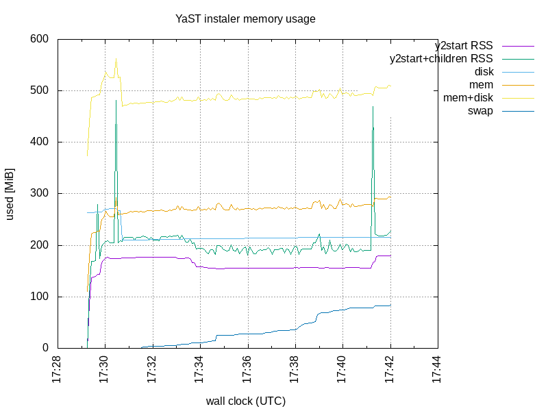

# Memsample

### Problem

Every now and then we get a report that the installer has crashed by running
out of memory
(latest: [bsc#1172139](https://bugzilla.suse.com/show_bug.cgi?id=1172139)).
So far we have managed to fix the problems. Now it is time for
a proactive approach: tracking the memory consumption across all
installations.

### TL;DR

To reproduce this, see Usage below.

### Approach

Previously we have inserted logging of memory measurements at critical points
of the main installer process (y2start or y2base).

**memsample** aims to get a full* picture of the install-time system
(aka *inst-sys*) by
1. taking a sample every few seconds
2. measuring the memory used by all the processes, and the RAM-disk (tmpfs)
3. having low overhead as to allow being always enabled in production

*: A significant problem with time-sampling memory or disk usage is that we may
miss short timed peaks. To detect those, an in-process alternative is needed.

### Implementation

At installation time, samples are taken by running the commands `free`, `df
/`, and `ps ...`.

Parsing the significant data from the output of these commands is not done
yet. Instead, the output is compressed (with gzip) in a crude archive format.
(This is a prototype-quality approach. With more thought and work we could be
more efficient both with CPU and memory.)

After the installation has concluded, the archive is post-processed to produce
an easily consumable CSV format. A graph is produced from that CSV with
Gnuplot.

### Usage

YaST the installer will start `memsample` automatically.

Memsample will log to a compressed file `/var/log/YaST2/memsample.zcat`. After
a successful installation this file will be packaged inside
`/var/log/YaST2/yast-installation-logs.tar.xz`

1. produce a `memsample.csv`, a CSV version of the collected data with
`memsample-archive-to-csv memsample.zcat`
or
`memsample-archive-to-csv -y yast-installation-logs.tar.xz`
2. produce `memsample.png` with
`memsample-csv-plot memsample.csv`

